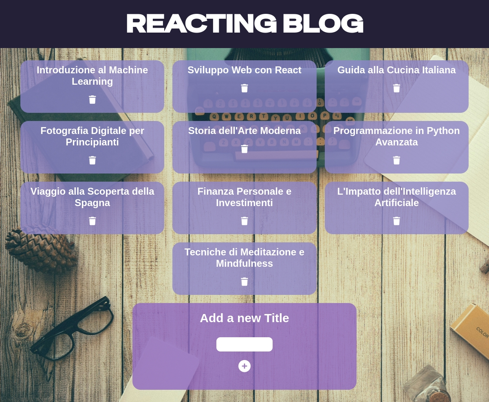

# React Blog Form

## Info

In questo esercizio, salvato come progetto n. 39, andiamo a lavorare sempre con react. L'obiettivo è creare una lista di articoli, prese tramite un array, e visualizzarle in pagina. Successivamente bisogna inserire un form che permetta di inserire un nuovo titolo e visualizzarlo in pagina. Andremo a lavorare con variabili dinamicizzate tramite useState e ascolto di eventi tramite onChange e per il form onSubmit.

## Bonus 1

Il bonus numero 1 consiste nell'inserire in pagina un bottone che permetta la rimozione del titolo. Quindi al click rimuovere il titolo dalla lista visualizzata in pagina.

## Bonus 2

Il bonus numero 2 consiste nella modifica della lista di articoli. Questo è possibile grazie alla generazione di un post tramite un click sul titolo.
Al click apparirà un input che permetterà la modifica del titolo. All'invio l'input non si vedrà più e il titolo apparirà modificato.

Ho apportato alcune modifiche riguardanti il CSS, qui di seguito il risultato finale.

